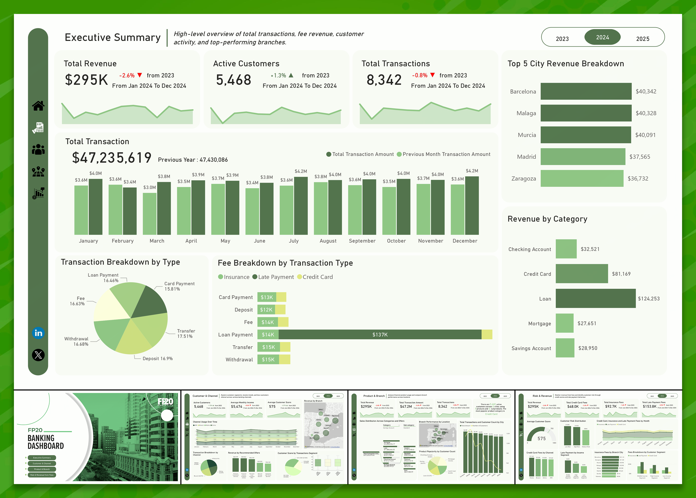

# 📊 Business Intelligence Projects Portfolio

Welcome to my BI project repository — a collection of data analytics and visualization projects I’ve worked on over the years using **Power BI**, **Excel**, **SQL**, and **real-world datasets**. Each folder contains the visuals, datasets, and supporting files for each project.

---

## 🧠 Contents

### 🔹 `fp20/Banking_DataSet_FP20Analytics_Challenge_27`
A challenge-based project analyzing banking customer behavior and financial metrics.

- 📁 Includes: `.pbix`, `.pdf`, image of final dashboard
- 🔍 Tools: Power BI, financial KPIs

---

### 🔹 `freelance/coffee sales`
Freelance project analyzing sales performance and trends for a coffee business.

- 📁 Includes: Sales data, Power BI dashboard, PDF export
- 🔍 Focus: Sales breakdown, product analysis, time trends

---

### 🔹 `freelance/logistics management`
BI solution for visualizing and optimizing logistics operations.

- 📁 Includes: Data, Power BI report, image
- 🔍 Focus: Shipment efficiency, delivery KPIs, cost management

---

### 🔹 `onyx/April, 2025`
Monthly performance report for Onyx client — April edition.

- 📁 Includes: Power BI report, image
- 🔍 Metrics: Sales, team performance, operations

---

### 🔹 `onyx/May, 2025`
Follow-up report with additional insights and visual enhancements.

- 📁 Includes: `.pbix`, `.pdf`, and multiple visuals
- 📝 Enhanced: Comparative KPIs, year-over-year metrics

---

## 🛠 Tools & Technologies
- Power BI
- Excel
- SQL (where applicable)
- PDF reporting
- Data modeling and transformation

---

## 📬 Contact
Have questions or want to collaborate?  
📧 Email: [iamnanasafo@gmail.com]  
🔗 LinkedIn: [https://linkedin.com/in/iamnanasafo]

---

> “Turning raw data into actionable insight is my passion. Thanks for visiting!”
